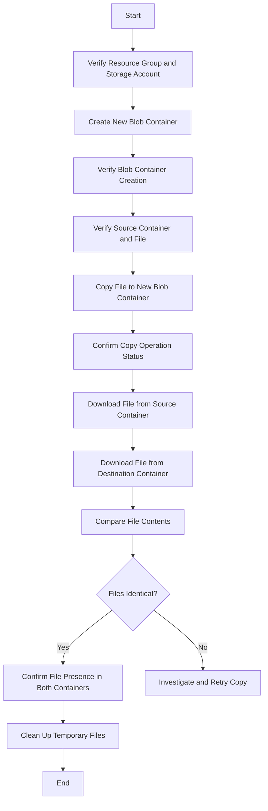

------------------------------

- [Requirements](#requirements)
- [Steps showLineNumbers](#steps-showlinenumbers)
- [Resources](#resources)

------------------------------

## Requirements

As part of a data migration project, the team lead has tasked the team with migrating data from an existing Azure Blob container to a new Blob container. The existing container contains a substantial amount of data that must be accurately transferred to the new container. The team is responsible for creating the new Blob container and ensuring that all data from the existing container is copied or synced to the new container completely and accurately. It is imperative to perform thorough verification steps to confirm that all data has been successfully transferred to the new container without any loss or corruption.

As a member of the Nautilus DevOps Team, your task is to perform the following:

1) Create a New Private Azure Blob Container: Name the container xfusion-dest-21957 under the storage account xfusionstorage20694.

2) Data Migration: Migrate the file xfusion.txt from the existing xfusion-source-10929 container to the new xfusion-dest-21957 container.

3) Ensure Data Consistency: Ensure that both containers have the file xfusion.txt and confirm the file content is identical in both containers.

4) Use Azure CLI: Use the Azure CLI to perform the creation and data migration tasks.

------------------------------

:::tip Note

The solution can be implemented using both the Azure Cloud Console and the Azure CLI. This document outlines the CLI-based approach to accomplish these tasks. It is recommended to first explore the Azure Cloud Console for hands-on experience and a practical understanding of the process before utilizing the CLI approach, unless specifically instructed otherwise.

:::

## Steps showLineNumbers

```bash
RG=$(az group list --query "[?contains(name, 'kml')].name" --output tsv)
STORAGE_ACCOUNT_NAME=xfusionstorage20694
CONTAINER_NAME=xfusion-dest-21957

STORAGE_ACCOUNT_KEY=$(az storage account keys list --resource-group $RG --account-name $STORAGE_ACCOUNT_NAME --query "[0].value" --output tsv)

# Create the Blob Storage container and set the access level to public
az storage container create \
  --name $CONTAINER_NAME \
  --account-name $STORAGE_ACCOUNT_NAME \
  --account-key $STORAGE_ACCOUNT_KEY \
  --public-access off
{
  "created": true
}

az storage container show \
  --name $CONTAINER_NAME \
  --account-name $STORAGE_ACCOUNT_NAME \
  --account-key $STORAGE_ACCOUNT_KEY \
  --query "{name:name, publicAccess:properties.publicAccess}" \
  --output table
# Name
# ------------------
# xfusion-dest-21957

# Verify that the source container exists and contains the file xfusion.txt.
az storage blob list \
  --container-name xfusion-source-10929 \
  --account-name $STORAGE_ACCOUNT_NAME \
  --account-key $STORAGE_ACCOUNT_KEY \
  --query "[?name=='xfusion.txt'].{name:name}" \
  --output table

#Copy the file xfusion.txt from the source container (xfusion-source-10929) to the destination container (xfusion-dest-21957).
az storage blob copy start \
  --destination-blob xfusion.txt \
  --destination-container $CONTAINER_NAME \
  --account-name $STORAGE_ACCOUNT_NAME \
  --account-key $STORAGE_ACCOUNT_KEY \
  --source-container xfusion-source-10929 \
  --source-blob xfusion.txt


#Confirm the copy operation status:
az storage blob show \
  --container-name $CONTAINER_NAME \
  --name xfusion.txt \
  --account-name $STORAGE_ACCOUNT_NAME \
  --account-key $STORAGE_ACCOUNT_KEY \
  --query "{name:name, copyStatus:properties.copy.status}" \
  --output table

#Step 2: Verify Data Consistency. Download the file from both the source and destination containers to compare content locally.


# Download from source container
az storage blob download \
  --container-name xfusion-source-10929 \
  --name xfusion.txt \
  --file source_xfusion.txt \
  --account-name $STORAGE_ACCOUNT_NAME \
  --account-key $STORAGE_ACCOUNT_KEY

# Download from destination container
az storage blob download \
  --container-name $CONTAINER_NAME \
  --name xfusion.txt \
  --file dest_xfusion.txt \
  --account-name $STORAGE_ACCOUNT_NAME \
  --account-key $STORAGE_ACCOUNT_KEY

# Compare the contents of both files to ensure they are identical. If the output is empty, the files are identical.
diff source_xfusion.txt dest_xfusion.txt

### Confirm File Presence in Both Containers. Check the presence of xfusion.txt in both containers:

# Source container
az storage blob list \
  --container-name xfusion-source-10929 \
  --account-name $STORAGE_ACCOUNT_NAME \
  --account-key $STORAGE_ACCOUNT_KEY \
  --query "[?name=='xfusion.txt'].{name:name}" \
  --output table

# Destination container
az storage blob list \
  --container-name $CONTAINER_NAME \
  --account-name $STORAGE_ACCOUNT_NAME \
  --account-key $STORAGE_ACCOUNT_KEY \
  --query "[?name=='xfusion.txt'].{name:name}" \
  --output table

```



## Resources

[Azure CLI Docs](https://learn.microsoft.com/en-us/cli/azure/)

------------------------------
